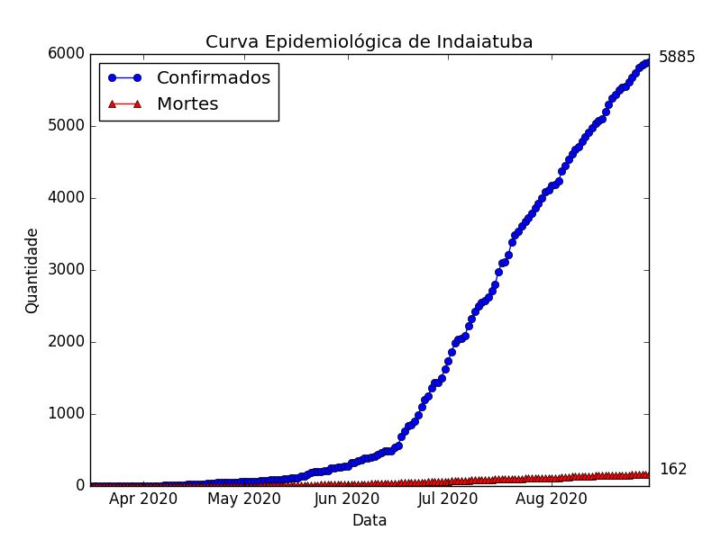
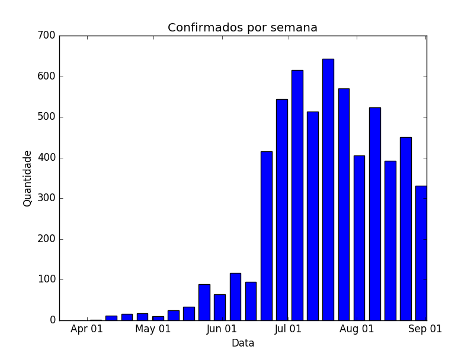

# Covid-19 em Indaiatuba

Dados da Epidemia de Covid em Indaiatuba

## Introdução

A partir dos dados disponibilizados pela prefeitura municipal de Indaiatuba, trouxe esse projeto para uma melhor visualização, visto que gráficos são mais fáceis de interpretar do que números.

## Gráfico

Data da atualização: 07/08/2020

No gráfico abaixo, temos o total de casos:

No gráfico abaixo temos o número de infectados por semana.

## Autor

* Alcides Goldoni Junior  - *Initial work* - [GitHub](https://github.com/agoldonijr) - [LinkedIn](https://www.linkedin.com/in/alcides-goldoni-junior-50911364/)

Para mais informações e de onde foram tirados os dados [Prefeitura de Indaiatuba - Novo Coronavirus](https://www.indaiatuba.sp.gov.br/saude/vigilancia-em-saude/vigilancia-epidemiologica/novo-coronavirus/).

### Colaborador

* Ian Liu Rodrigues [GitHub](https://github.com/ianliu) 

## Licença 

Esse projeto está sob MIT License 

